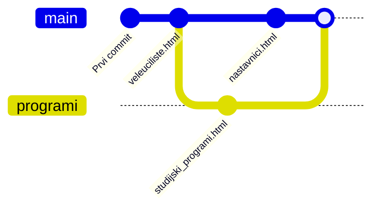

# 1. Laboratorijska vježba – Git i GitHub

## Sadržaj vježbe

* Git
* GitHub
* Zadaci za rad u laboratoriju

---

## Git

Git je sustav za upravljanje promjenama u kodu. Kontrola verzija (**Version Control System**) bilježi promjene datoteka ili skupa datoteka tako da se kasnije možemo kretati naprijed ili natrag kroz povijest promjena.

---

## GitHub

GitHub pruža Internet hosting na kojem kreiramo **udaljeni repozitorij**.

Programer može:

* preuzeti (**clone**) udaljeni repozitorij na svoje računalo
* raditi na projektu **lokalno**
* poslati promjene natrag na repozitorij

Prije upotrebe potrebno je registrirati se na:

```
https://github.com
```
---

## Zadaci za rad u laboratoriju

> [!NOTE]
> **Prije početka vježbe:**
>
> Preko termianala provjeriti verziju **git-a** te postaviti **username i email**:
>
> ```bash
> git -v
> git config --global user.name "Vaše ime"
> git config --global user.email "vas@email.com"
> ```
>
> Za ispis postavljenih **username** i **email**:
>
> ```bash
> git config --global user.name
> git config --global user.email
> ```
>
> **Zašto je to važno**
>
> Svaki commit u Git-u ima autora.
>
> Primjer:
>
> ```text
> Author: Pero Peric <pero.peric@email.com>
> ```
>
> Ako ovo nije postavljeno:
>
> - commit može biti označen kao nepoznat
> - GitHub neće povezati commit s korisničkim računom

---
### Zadatak 1

1. Kreirati mapu (upisujete svoje prezime):

```bash
spj_lv1_{prezime}
```

2. Preuzeti **LV1_prilog.zip** sa Loomen stranice i otpakirati ga.

3. Prebaciti sadržaj mape **LV1_prilog** u mapu:

```
spj_lv1_{prezime}
```

---

### Zadatak 2

Mapu **spj_lv1_{prezime}**:

1. Otvoriti u **VS Code**
2. U terminalu inicijalizirati Git repozitorij:

```bash
git init
```

Dodati datoteke u upravno područje **(engl. staging area)**:

```bash
git add .
```

Napraviti prvi commit:

```bash
git commit -m "Prvi commit"
```

---

### Zadatak 3

1. Otvoriti GitHub i prijaviti se.
2. Kreirati novi repozitorij:

```
spj_lv1_{prezime}
```

Repozitorij treba biti **private**.

Zatim u VS Code terminalu povezati lokalni projekt s udaljenim repozitorijem:

```bash
git remote add origin URL_REPOZITORIJA
```

U slučaju da je glavna grana **master**, preimenovati ju u **main**:
```bash
git branch -M main
```
poslati kod na GitHub:

```bash
git push -u origin main
```
---

### Zadatak 4

1. Kreirati stranicu:

```
veleuciliste.html
```

Dodati datoteku u upravno područje:

```bash
git add veleuciliste.html
```

Napraviti commit:

```bash
git commit -m "Dodana stranica veleuciliste.html"
```

Poslati promjene na GitHub:

```bash
git push
```

---

### Zadatak 5

Kreirati novu granu **programi** i prebaciti se na nju:

```bash
git branch programi
git checkout programi
```

Kreirati stranicu:

```
studijski_programi.html
```

Dodati datoteku i poslati promjene:

```bash
git add .
git commit -m "Dodana stranica studijski_programi.html"
git push -u origin programi
```

---

### Zadatak 6

Vratiti se na glavnu granu:

```bash
git checkout master
```

Kreirati stranicu:

```
nastavnici.html
```

Dodati datoteku:

```bash
git add .
```

Commit:

```bash
git commit -m "Dodana stranica nastavnici.html"
```

Push:

```bash
git push
```

Spojiti granu **programi** sa glavnom granom:

```bash
git merge programi
```

**Graf promjena nakon spajanja grane programi u glavnu granu:**

---

### Zadatak 7

Dodati sudionika u repozitorij.

Putanja na GitHubu:

```text
Settings → Access → Collaborators → Add people
```

Sudionik treba:

1. Preuzeti repozitorij (clone):

```bash
git clone https://github.com/USERNAME/spj_lv1_prezime.git
```

Ući u mapu kloniranog repozitorija:

2. Otvoriti u **VS Code**

3. Kreirati stranicu:

```text
kontakt.html
```

4. Dodati datoteku:

```bash
git add kontakt.html
```

5. Provjeriti stanje:

```bash
git status
```

6. Napraviti commit:

```bash
git commit -m "Dodana stranica kontakt.html"
```

7. Poslati promjene:

```bash
git push
```

Nakon toga vlasnik repozitorija treba sinkronizirati svoj lokalni kod:

```bash
git pull
```

---

> [!TIP]
> URL repozitorija možete kopirati na GitHubu klikom na:
>
> **Code → HTTPS → Copy**

---